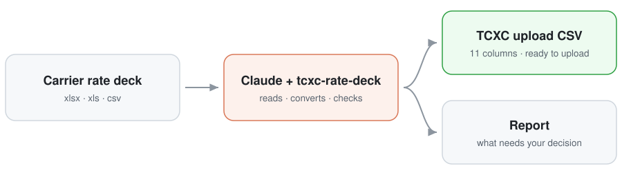

<div align="center">

# TCXC Rate Deck

**Convert any carrier's voice rate deck into a [TelecomsXchange](https://www.telecomsxchange.com) upload file, with Claude.**

[](https://github.com/TelecomsXChangeAPi/tcxc-rate-deck-skill/releases/latest)
[](#how-to-install)
[](#requirements)
[](LICENSE)

[Install](#how-to-install) · [Convert a deck](#how-to-convert-a-rate-deck) · [Upload format](#what-is-the-tcxc-upload-format) · [Example](#example) · [FAQ](#faq)

</div>

---

**tcxc-rate-deck is an open-source Claude skill and Claude Code plugin that converts wholesale voice carrier rate decks — price lists, rate sheets, A-Z files and rate amendments in Excel (`.xlsx`, `.xls`) or CSV — into the 11-column TelecomsXchange (TCXC) rate upload CSV that sellers upload to publish routes.** It reads the deck, writes an upload-ready file, checks it against the TCXC format, and reports anything that needs a human decision before the rates go live.

Carrier price lists arrive in every shape: notice blocks above the table, dial codes packed into lists and ranges, billing increments hidden in footnotes, removed codes on a separate sheet. Reformatting them by hand in Excel is slow and quietly expensive: a `60/1` typed as `60/60` bills whole minutes on routes the carrier charges per second, and prices rounded to four decimals can sell below cost on every minute.

<p align="center">
  <picture>
    <source media="(prefers-color-scheme: dark)" srcset="docs/flow-dark.svg">
    
  </picture>
</p>

## What it does

<table>
<tr>
<td width="50%" valign="top">

**Reads any layout**<br/>
Finds the sheet, header row and columns on its own. Handles notice blocks, code lists and ranges, split country and area codes, `+` and `00` prefixes, day-first or US dates and decimal commas.

</td>
<td width="50%" valign="top">

**Gets billing right**<br/>
Splits increments such as `60/1` into Interval 1 and Interval N, or applies the increment rules written in a deck's notes.

</td>
</tr>
<tr>
<td width="50%" valign="top">

**Keeps removals and blocks**<br/>
Codes the carrier closes or removes go out as Discontinued, blocked codes as Forbidden, with their dates.

</td>
<td width="50%" valign="top">

**Flags what needs you**<br/>
Rates far below the rest of their country, decks that look out of date, future-dated codes that fall back to a cheaper prefix, and assumed defaults.

</td>
</tr>
<tr>
<td width="50%" valign="top">

**Stops instead of guessing**<br/>
Two possible price columns, or codes that could be ranges or country-area pairs? It asks rather than picks.

</td>
<td width="50%" valign="top">

**Fixes existing files**<br/>
Checks and repairs hand-made or Excel-saved TCXC files. Never rounds a price down; a markup is applied only when you ask, and rounds up.

</td>
</tr>
</table>

## How to install

### Claude Code

Run these two commands inside Claude Code:

```text
/plugin marketplace add TelecomsXChangeAPi/tcxc-rate-deck-skill
/plugin install tcxc-rate-deck@tcxc
```

The scripts need Python with pandas and openpyxl (`pip install pandas openpyxl`); Claude tells you if they are missing.

<details>
<summary><b>Claude apps (claude.ai and desktop)</b></summary>
<br/>

Download `tcxc-rate-deck.zip` from the [latest release](https://github.com/TelecomsXChangeAPi/tcxc-rate-deck-skill/releases/latest) and upload it under **Settings > Features**. Custom skills are available on Pro, Max, Team and Enterprise plans with code execution enabled.

</details>

<details>
<summary><b>Claude API</b></summary>
<br/>

Upload the `skills/tcxc-rate-deck` folder through the Skills API and use it with the code execution tool. See [Using Agent Skills with the API](https://platform.claude.com/docs/en/build-with-claude/skills-guide).

</details>

<details>
<summary><b>Plain skill folder, without the plugin</b></summary>
<br/>

```bash
git clone https://github.com/TelecomsXChangeAPi/tcxc-rate-deck-skill.git
cp -r tcxc-rate-deck-skill/skills/tcxc-rate-deck ~/.claude/skills/
```

To install it for one project only, copy the folder into that project's `.claude/skills/` instead.

</details>

## How to convert a rate deck

Give Claude the file and say what you want:

```text
Convert ~/Downloads/supplier_rates.xlsx into a TCXC upload file. Keep the carrier's exact prices, no markup. Save it to ~/Downloads and tell me anything I should check before uploading.
```

Or call the skill by name (`/tcxc-rate-deck` when installed as a plain folder):

```text
/tcxc-rate-deck:tcxc-rate-deck ~/Downloads/supplier_rates.xlsx
```

> [!TIP]
> Prompts work best with the full file path, whether you want exact prices or a markup, and where to save the result.

### Example prompts

- *"Convert ~/Downloads/amendment.xlsx to TCXC format with an 11% markup, and use the billing increments from the notes in the sheet"*
- *"Check ~/Downloads/my_upload.csv against the carrier's original ~/Downloads/price_list.xlsx and give me a fixed file if anything is wrong"*
- *"Our supplier sent a new A-Z price list, prepare it for upload to TCXC: ~/Downloads/new_supplier_rates.xlsx"*

### Follow-ups that work well

- *"block 24997 until the carrier confirms"*
- *"add an 11% markup"*
- *"use the peak rate column"*
- *"start the future-dated codes ASAP"*
- *"the Brazil rows should be 60/60, redo it"*

### What you get back

The upload CSV and a short report. Behind the report is the converter's summary, shown here (abridged) for the [example deck](examples/acme_rate_notice.xlsx):

```text
Deck:     acme_rate_notice.xlsx (sheet 'Rate Notice', header on row 7)
Columns:  code <- 'Dial Codes' | rate <- 'Rate/Min' | effective <- 'Effective' (%d/%m/%Y) | increments <- 'Billing'
Codes:    hyphenated codes read as ranges (e.g. 49172-49174 -> 49172..49174)
Rows:     25 codes from the deck -> 25 TCXC rows; 1 row without a code skipped
Effective from: ASAP 18, dated 7
Increments: 1/1: 13, 60/60: 7, 60/1: 5 (from increment column 25)
Flags:    Forbidden 0, Discontinued 1
Check before upload:
  - 5 codes (49152, 49162, 49172 +2 more) only start 2026-09-23 00:00:00; if they are not already live
    on TCXC, their calls match 49 at 0.0078 until then (they are priced from 0.0495)
RESULT: VALID
```

## What is the TCXC upload format?

The TCXC rate upload file is a CSV with exactly 11 columns, in this order, one row per dial code:

```csv
Country,Description,Prefix,Effective from,Rate Id,Forbidden,Discontinued,Price 1,Price N,Interval 1,Interval N
,,447700,ASAP,,0,0,0.0125,0.0125,1,1
,,4915,2027-01-01 00:00:00,,0,0,0.0421,0.0421,60,1
,,5511,ASAP,,0,0,0.0098,0.0098,30,6
```

| Column | Value |
|---|---|
| `Country`, `Description` | empty |
| `Prefix` | full dial code, digits only |
| `Effective from` | `ASAP`, or a future date as `YYYY-MM-DD HH:MM:SS` |
| `Rate Id` | empty |
| `Forbidden`, `Discontinued` | `0` or `1`, never blank |
| `Price 1`, `Price N` | price per minute as a plain decimal |
| `Interval 1`, `Interval N` | billing increments in whole seconds: `60` and `1` for 60/1 |

[SKILL.md](skills/tcxc-rate-deck/SKILL.md) explains every column and how TCXC applies effective dates.

## Example

| File | What it is |
|---|---|
| [`examples/acme_rate_notice.xlsx`](examples/acme_rate_notice.xlsx) | A fictional supplier deck with a notice block, code lists, ranges, text dates, a billing column and a closed code |
| [`examples/acme_rate_notice_tcxc.csv`](examples/acme_rate_notice_tcxc.csv) | The converter's output, produced with `--now 2026-09-17` so the dates stay reproducible |

<details>
<summary><b>Run the scripts without Claude</b></summary>
<br/>

```bash
python skills/tcxc-rate-deck/scripts/convert_to_tcxc.py deck.xlsx --out tcxc_upload.csv
python skills/tcxc-rate-deck/scripts/validate_tcxc.py tcxc_upload.csv
```

Run `convert_to_tcxc.py --help` for every option.

</details>

## FAQ

### What is a rate deck?

A rate deck (also called a rate sheet, price list or A-Z list) is the file a wholesale voice carrier sends its customers listing the price per minute for every destination it terminates. Each row carries a dial code such as `447700`, a price per minute, an effective date and a billing increment. An A-Z deck covers every destination worldwide and can run to hundreds of thousands of rows.

### How do I convert a carrier price list into the TCXC format?

Install this skill, then ask Claude to convert the file: *"Convert ~/Downloads/supplier_rates.xlsx into a TCXC upload file."* Claude reads the deck, maps the code, price, date and increment columns, writes the 11-column CSV, validates it and reports what needs your decision. Nothing is uploaded for you: you get a file to upload yourself.

### What does a billing increment like 60/1 mean?

`60/1` means the first 60 seconds of a call are billed as a full minute, and every second after that is billed individually. In the TCXC upload file it becomes Interval 1 = 60 and Interval N = 1. Common increments are `1/1` (per second), `60/60` (whole minutes) and `30/6`. Writing `60/1` into a single interval cell breaks the upload, which is a frequent mistake in hand-made files.

### What do Forbidden and Discontinued mean in a TCXC upload?

`Forbidden = 1` blocks a route so it stops selling, which is what you use for a rate you suspect is a carrier error. `Discontinued = 1` withdraws a code the carrier has removed from its deck. Both take effect immediately when the row is `ASAP`. Every other row should carry `0` in both columns; leaving them blank makes the file invalid.

### Does this work with claude.ai, or only Claude Code?

Both. In Claude Code it installs as a plugin with two commands. In the Claude apps (claude.ai and desktop) you upload the release zip under Settings > Features, on a plan with code execution enabled. It also runs through the Claude API's Skills API with the code execution tool. The converter and validator are plain Python, so you can run them without Claude at all.

### Does my rate data leave my computer?

The skill's scripts make no network calls: they read the deck you point them at and write a CSV next to it. In Claude Code everything runs locally on your machine. In the Claude apps and the API, files you upload are processed in Claude's code execution container.

### Which carriers' rate decks are supported?

Any carrier's, because the converter maps columns by what they contain rather than by a per-carrier template. It has been tested on large A-Z price lists (18,000+ codes), amendment files with billing rules in footnotes and a separate code-changes sheet (120,000+ codes), and small supplier notices with codes packed into lists and ranges. When a deck is genuinely ambiguous it stops and asks instead of guessing.

## Requirements

- Python 3.8 or newer with pandas and openpyxl (plus xlrd for old `.xls` files)
- Tested with Python 3.14, pandas 3.0 and openpyxl 3.1
- No network access: the scripts only read the deck you give them and write a CSV

> [!IMPORTANT]
> The skill catches a lot, but you are responsible for the rates you publish. Read the report, look at any flagged rows and keep the carrier's original deck.

## Development

```bash
pip install pandas openpyxl pytest
pytest
```

13 tests cover the example deck, code lists and ranges, joined country and area codes, increment rules, BI Type increment columns, markup rounding, repairing hand-edited files, and the checks that stop an ambiguous deck.

## Contributing

Issues and pull requests are welcome, especially rate deck layouts the converter does not handle yet. Please do not attach real carrier price lists: describe the layout, or share a copy with the codes and prices replaced.

## License

[MIT](LICENSE)

---

<div align="center">
<sub>Made for sellers on <a href="https://www.telecomsxchange.com">TelecomsXchange</a> · maintained by <a href="https://github.com/TelecomsXChangeAPi">TelecomsXChange</a> · v1.0.0, September 2026</sub>
</div>
